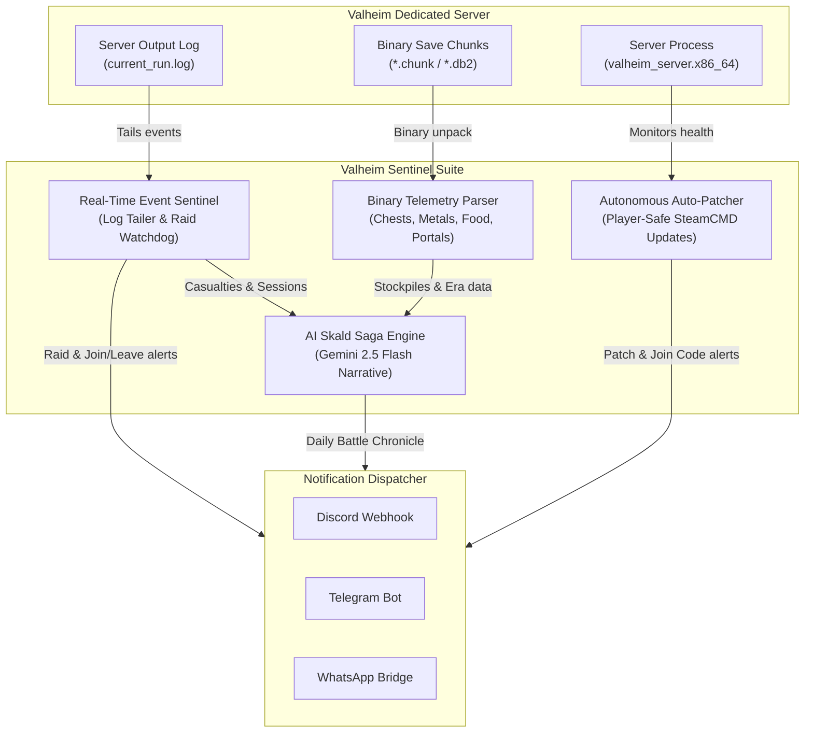

# 🛡️ Valheim Sentinel & AI Skald

[](https://opensource.org/licenses/MIT)
[](https://www.python.org/downloads/)
[]()
[]()

> **Autonomous Game SRE, Binary Save Telemetry, and Generative Norse Chronicle Engine for Valheim Dedicated Servers.**

Valheim Sentinel turns your Valheim dedicated server into an intelligent, self-monitoring, and storytelling realm. It monitors game logs in real-time, reverse-engineers binary world saves (`.db` / `.db2` / `.chunk`) to inspect clan wealth and metallurgy, orchestrates zero-downtime player-safe updates, and synthesizes authentic Norse sagas via Google Gemini AI.

---

## ⚡ Key Capabilities



1. **Player-Safe SteamCMD Auto-Patcher & Watchdog:**
   - Detects remote Steam updates via Web API (~200ms latency).
   - If players are active in-game, updates are deferred until the server is empty.
   - Creates timestamped snapshots of your world saves before applying updates.
   - Graceful shutdown allowing Unity `ZNet` clean world flush (`SIGINT`).
   - Self-healing watchdog reboots crashes and extracts the new PlayFab Join Code.

2. **Deep Binary World Save Telemetry (`.db` / `.chunk`):**
   - Reverse-engineers ZDO container payloads across world chunk files.
   - Tracks clan treasury (gold coins, amber, rubies, merchant purchasing power).
   - Tracks metallurgy & forge capacity (Bronze, Iron, Silver, Black Metal, Flametal).
   - Tracks food pantries, optimal 3-food nutrition combos, and boss summon tributes.
   - Extracts live portal directories (tags and 3D world coordinates).

3. **Real-Time Event Sentinel & Comedic Roasts:**
   - Real-time player connection and departure alerts.
   - Includes 100+ context-aware Norse comedic roasts (rage-quits, falling tree deaths, naked corpse runs, 25 HP panics).
   - **Horn of War:** Instant siren on raid events with active defenders called to arms.
   - Boss defeat war-cries celebrating fallen Forsaken.

4. **The AI Skald (Generative Norse Chronicles):**
   - Synthesizes 24-hour gameplay telemetry into an authentic Norse saga using Google Gemini 2.5 Flash.
   - **Zero Hallucination Standard:** Lore is strictly grounded in empirical server facts (biomes explored, real causes of death, recorded raids).
   - Zero-token cost architecture for real-time interactions, reserving LLM budget exclusively for narrative storytelling.

5. **Universal Notification Channels:**
   - Plug-and-play **Discord Webhooks** (zero configuration for gaming clans).
   - **Telegram Bot API** with formatted HTML messages.
   - **WhatsApp HTTP Bridge** (Baileys / Hermes integration).

---

## 🚀 Quickstart Guide

### 1. Prerequisites
- Linux Server / VPS (Ubuntu, Debian, CentOS, or Arch)
- Python 3.8+
- SteamCMD (`apt install steamcmd` or distro package)
- `tmux`

### 2. Clone & Configure
```bash
git clone https://github.com/harirajrathod/valheim-sentinel.git
cd valheim-sentinel

# Copy environment template
cp .env.example .env
```

Edit `.env` with your preferred settings:
```bash
# Set your server name and password
VALHEIM_SERVER_NAME="Iron Keep"
VALHEIM_WORLD_NAME="ValheimWorld"
VALHEIM_SERVER_PASSWORD="MyVikingPassword123"

# Add your Discord Webhook (or Telegram / WhatsApp)
DISCORD_WEBHOOK_URL="https://discord.com/api/webhooks/your/webhook/url"

# (Optional) Add your free Google AI Studio key for AI Chronicles
GEMINI_API_KEY="your_gemini_api_key_here"
```

### 3. Install Valheim Server Files
```bash
bash scripts/install_server.sh
```

### 4. Launch Server & Sentinel
```bash
# Launch server in background tmux session with crash auto-recovery
bash scripts/start_server.sh

# In a separate terminal or service, launch the real-time event sentinel
python3 -m monitor.sentinel
```

---

## 🛠️ CLI Cheatsheet

### Auto-Patcher & Watchdog
```bash
# Check if an official Steam update is available
python3 -m core.autopatch --check

# Check current server status and active players
python3 -m core.autopatch --status

# Cron-mode: patches if empty or updates watchdog
python3 -m core.autopatch --cron

# Force patch immediately
python3 -m core.autopatch --force
```

### Daily Battle Chronicle
```bash
# Preview today's chronicle locally (dry-run)
python3 -m skald.daily_chronicle --dry-run

# Broadcast 24h battle journal to Discord/Telegram/WhatsApp
python3 -m skald.daily_chronicle --post
```

---

## ⏰ Recommended Cron Schedule

Add the following to your `crontab -e`:

```cron
# Check for updates or revive crashed server every 15 minutes
*/15 * * * * cd /path/to/valheim-sentinel && /usr/bin/python3 -m core.autopatch --cron >> /var/log/valheim_cron.log 2>&1

# Post Daily Battle Chronicle every morning at 09:00 AM
0 9 * * * cd /path/to/valheim-sentinel && /usr/bin/python3 -m skald.daily_chronicle --post >> /var/log/valheim_cron.log 2>&1
```

---

## 🧪 Testing

Run the built-in test suite:
```bash
python3 -m unittest discover -s tests
```

---

## 📜 License

Distributed under the [MIT License](LICENSE). Free for personal and commercial community game servers.
